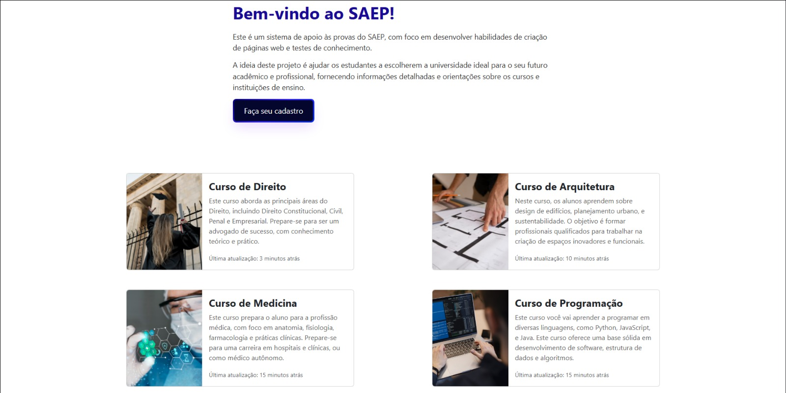
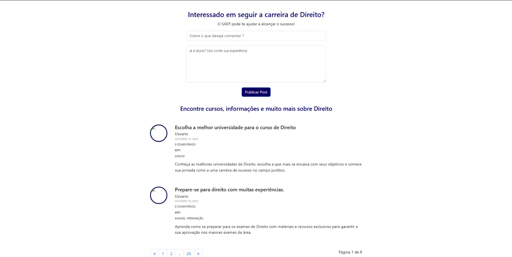

# Sistema de Apoio às Provas do SAEP

## Objetivo
O Sistema de Apoio às Provas do SAEP foi desenvolvido com o intuito de ajudar estudantes a escolherem a universidade ideal para o seu futuro acadêmico e profissional, além de proporcionar um espaço interativo para o aprendizado e desenvolvimento de habilidades em criação de páginas web e testes de conhecimento. O foco é fornecer informações detalhadas sobre cursos e instituições de ensino, abordando tanto o aspecto acadêmico quanto a preparação para as provas do SAEP.

## Tecnologias Utilizadas

- **Frontend**:
   - **HTML/CSS**: Estruturação e estilização da página.
   - **JavaScript**: Funcionalidades interativas como navegação entre os cursos.
   - **Frameworks**: Utilização de frameworks CSS, como Bootstrap, para garantir um design responsivo e eficiente.

- **Backend**:
   - **Node.js**: Utilizado para o desenvolvimento do backend, possibilitando o gerenciamento de rotas, requisições e manipulação de dados.
   - **Banco de Dados SQL**: Para armazenar e gerenciar dados relacionados aos cursos e atualizações, utilizando uma estrutura de banco de dados relacional.

- **Renderização de Páginas**:
   - **EJS (Embedded JavaScript)**: Utilizado para renderizar as páginas dinamicamente no backend, permitindo a injeção de dados diretamente nas views, o que facilita a atualização de conteúdos e interações com o banco de dados.


## Tela Inicial


## Funcionalidade de Cursos



## Tela de Feedback



## Detalhamento do Curso


## Funcionalidades
A landing page do sistema de apoio oferece as seguintes funcionalidades principais:

1. **Apresentação do Sistema**:
   - Texto explicativo sobre o propósito do sistema, que é apoiar os estudantes na escolha da universidade ideal com base nos cursos oferecidos e no preparo para o ingresso nas instituições.

2. **Detalhes dos Cursos**:
   - **Curso de Direito**: Aborda áreas essenciais do Direito, incluindo Direito Constitucional, Civil, Penal e Empresarial. Foca no desenvolvimento de conhecimento teórico e prático para formação de advogados.
   - **Curso de Arquitetura**: Envolve temas sobre design de edifícios, planejamento urbano, e sustentabilidade, com o objetivo de formar profissionais para criar espaços inovadores e funcionais.
   - **Curso de Medicina**: Foca na formação de médicos, com ênfase em anatomia, fisiologia, farmacologia e práticas clínicas, preparando os alunos para atuar em hospitais e clínicas ou como médicos autônomos.
   - **Curso de Programação**: Ensina o desenvolvimento de software, com foco em linguagens como Python, JavaScript e Java, abordando também estruturas de dados e algoritmos.

3. **Interação do Usuário**:
   - O sistema permite que os usuários naveguem entre as informações dos cursos, com um botão "Next" para avançar para a próxima informação e "Previous" para retornar à anterior.

4. **Design Responsivo**:
   - A landing page é projetada para se adaptar a diferentes dispositivos (móvel, tablet, desktop), garantindo uma boa experiência de navegação em qualquer tela.

5. **Sistema de Atualizações**:
   - As informações sobre os cursos são atualizadas constantemente, com uma indicação de "Última atualização" para mostrar quando o conteúdo foi modificado pela última vez.

## Estrutura da Página

1. **Cabeçalho**:
   - **Logo**: "SAEP - Prova".
   - **Saudação ao Visitante**: A landing page começa com uma saudação ao visitante, criando uma interação mais amigável.
   - **Menu de Navegação**: Links para outras seções do sistema (como informações adicionais sobre cursos, testes, etc.).

2. **Seção de Introdução**:
   - Texto explicativo sobre o sistema de apoio às provas do SAEP, destacando seu papel no auxílio à escolha da universidade e no desenvolvimento de habilidades para a prova.

3. **Seção de Cursos**:
   - **Curso de Direito**: Informações sobre o conteúdo abordado e o perfil do estudante que se formará.
   - **Curso de Arquitetura**: Detalhes sobre as habilidades que o estudante irá desenvolver e o tipo de atuação profissional esperada.
   - **Curso de Medicina**: Foco nas áreas essenciais da medicina e nas oportunidades de carreira.
   - **Curso de Programação**: Detalhamento das linguagens de programação ensinadas e o conhecimento prático adquirido.

4. **Interatividade**:
   - Botões de navegação para passar de uma seção para outra: "Previous" e "Next".

5. **Rodapé**:
   - Informações de contato, links para redes sociais, e termos de uso.

## Como Rodar o Projeto

### 1. **Clone o repositório:**
   - Execute o seguinte comando no seu terminal para clonar o repositório:
     ```bash
     git clone <URL do repositório>
     ```

### 2. **Acesse o diretório do projeto:**
   - Navegue até a pasta do projeto com o comando:
     ```bash
     cd <nome do diretório>
     ```

### 3. **Instale as dependências e inicie o servidor com um único comando:**
   - Instale as dependências necessárias e inicie o servidor com:
     ```bash
     npm install && npm run dev
     ```

### 4. **Acesse a aplicação no navegador:**
   - Depois de iniciar o servidor, você pode acessar a aplicação no seu navegador utilizando o seguinte endereço:
     ```bash
     http://localhost:3001
     ```

## Melhorias Futuras

### 1. **Integração com Banco de Dados:**
   - Implementar um sistema de banco de dados para atualizar automaticamente as informações dos cursos, como o nome do curso, a última atualização, e outros detalhes.

### 2. **Simulador de Provas do SAEP:**
   - Desenvolver uma funcionalidade para que os estudantes possam realizar simulados das provas do SAEP, testando seus conhecimentos de forma prática.

### 3. **Filtro de Cursos:**
   - Adicionar funcionalidades de filtro para que os estudantes possam buscar cursos com base em áreas de interesse, localização, tipo de instituição, entre outros critérios.

